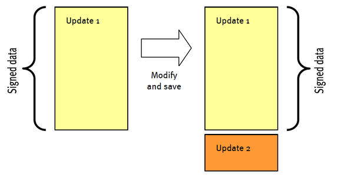
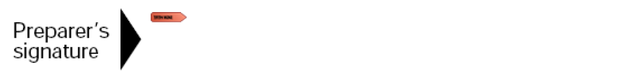
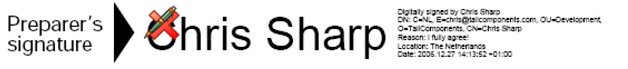
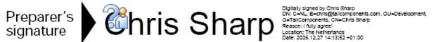
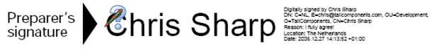
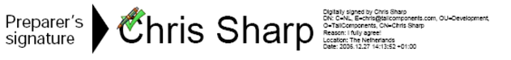
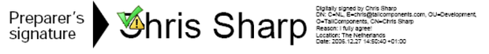

# Digital signatures

Digitally signed PDF documents (or messages in general) include two parties: the sender and the recipient. The sender applies a digital signature using a private key. It is assumed that only the sender has access to the private key and therefore it represents the identity of the sender. Using the public key, the recipient can confirm with high confidence that the signature was applied with the sender's private key and so by the only person who has access to the private key. The recipient can also be confident that the document has not been modified since it was signed.


## Signature Encodings

This application allows you to sign, verify and validate signature fields using all standard signature encodings. These encodings are:
&nbsp;<ul><li>
adbe.x509.rsa_sha1 (PKCS #1)</li><li>
adbe.pkcs7.detached (PKCS #7)</li><li>
adbe.pkcs7.sha1 (PKCS #7)</li></ul>

## Verification

Verification is the process of determining whether the data that has been signed, has not been changed after it has been signed. If the signed data has not been modified after signing, the signature is said to be verified. The following code opens a PDF document and dumps the verification status of each signature field:


```
using ( FileStream file = new FileStream(
   "f1040a_signed.pdf", FileMode.Open, FileAccess.Read ) )
{
   Document document = new Document( file );
   foreach ( Field field in document.Fields )
   {
      // retrieve signature field
      SignatureField signature = field as SignatureField;
      if ( null != signature  && signature.IsSigned )
      {
         // verifiy signature using standard signature handler
         bool verified = signature.Verify();
         Console.WriteLine( "signature {0} {1} been verified",
            signature.FullName,
            verified ? "has" : "has NOT" );
      }
   }
}
```

Code sample: Verify all fields (Verify)


You may wonder why we chose a parameterless method Verify, instead of a more elegant getter Verified. The reason for having a method is that we offer 2 more overloads that let you pass a custom signature handler or a signature handler factory.


## Updates

It is possible to change a PDF document, e.g. by filling out fields, and to save the changes incrementally. If the document was signed prior to saving the incremental changes, then the signature field still verifies successfully because the data that has been signed has not changed. The property SignatureField.DocumentModifiedAfterSigning lets you check whether incremental changes have been added to the document as an update.

<br /><br />
**Save changes incrementally as an update**
<br />
Figure 6 -10 shows how changes are saved incrementally as an update. Update 1 remains unchanged while Update 2 includes all changes. If Update 1 was signed, that signature will still verify successfully after saving because the update has not changed. After saving, the property SignatureField.DocumentModifiedAfterSigning returns false, while it returns true prior to saving.


## Validation

While verification is an objective process, validation is not because it involves trust. After verification succeeds, the next step is to decide whether the signer can be trusted (or whether the identity is known). If so, the signature is said to be validated, otherwise it is not. This step is to be executed by your own code by inspecting the SignatureField.Certificates property.


## Signing

The following code sample shows how to digitally sign a PDF document. The signature field is named “SignHere”. The certificate is stored inside the file “ChrisSharp.pfx”. This file was exported from the Windows key store. The password of the key store is “Sample”.


```
  // open PDF form with signature field      
using ( FileStream inFile = new FileStream( 
   "f1040a.pdf", FileMode.Open, FileAccess.Read ) )
{
   Document document = new Document(inFile);

   // open certicate store.
   Pkcs12Store store = null;
   using (FileStream file = new FileStream( 
      "ChrisSharp.pfx", FileMode.Open, FileAccess.Read))
   {
      store = new Pkcs12Store( file, "Sample" );
   }

   // let the class factory decide which type should be used.
   SignatureHandler handler = StandardSignatureHandler.Create( store );

   // sign signature field
   SignatureField field = document.Fields[ "SignHere" ] as SignatureField;
   field.SignatureHandler = handler;

   // set optional info.
   field.ContactInfo = "+31 (0)77 4748677";
   field.Location = "The Netherlands";
   field.Reason = "I fully agree!";

   // write signed document to disk. signing requires read-write file access
   using ( FileStream outFile = new FileStream( 
      "f1040a_signed.pdf", FileMode.Create, FileAccess.ReadWrite ) )
   {
      document.Write( outFile );
   }
}
```

Code sample: Digitally sign a PDF document (Sign)


## Signature Field States

A signature field can have different states. These are shown in the next figures.

<br /><br />
**IsSigned == false;**
<br /><br /><br />
**IsSigned == true; Verify() == false;**
<br /><br /><br />
**IsSigned == true; Verify() == true; DocumentModifiedAfterSigning ==false; not trusted**
<br /><br /><br />
**IsSigned == true; Verify() == true; DocumentModifiedAfterSigning ==true; not trusted**
<br /><br /><br />
**IsSigned == true; Verify() == true; DocumentModifiedAfterSigning ==false; trusted**
<br /><br /><br />
**IsSigned == true; Verify() == true; DocumentModifiedAfterSigning ==true; trusted**
<br />