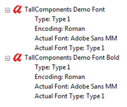

# Fonts

The appearance of text in a PDF document is defined by its font. The PDF format allows fonts to be embedded in a document, so that text can be reproduced faithfully on any machine independently of which fonts are installed on the client machine.


By default, PDFControls.NET will interpret these definitions and use this to render text as a number of (curved) lines that are filled with a particular color. This leads to graphical output of high quality. There are two issues however that may need to be addressed by the application programmer.
&nbsp;<ul><li>
The PDF format does not require fonts to be embedded. Fonts are sometimes not embedded, because they can add significantly to the file size. In that case, the application will have to decide how to render the text. In general this is done by selecting a font that is available on the system and that approximates the properties of the referenced font. This process is called font substitution. PDFControls.NET has its own default substitution scheme that is based on the font name. This approach will give reasonable results in many common cases, but this will not always suffice.</li><li>
Rendering a font as a collection of curved lines leads to a large number of low level GDI drawing instructions. This often works well on screen, but during printing it may lead to large spool files and (consequently) slow printing. To deal with this, it is advisable to substitute the referenced fonts by system fonts. Note that this technique also applies to fonts that are embedded in the document.</li></ul>&nbsp;
Below, we will have a look at the mechanisms that PDFControls.NET offers for dealing with this. Central to controlling the rendering of text is the TextRenderSettings class which can be accessed through the RenderSettings.TextSettings property, which is present as a property on all viewers.


## Font substitution map

The TextSettings contain a FontSubstitutionMap property. This property applies to non-embedded fonts only and it allows PDF font names to be mapped to font definition files on your file system. Often, one will refer to font files that are installed in the fonts folder of the system, but this is not mandatory. It is also possible to refer to files that are located elsewhere.


The font substitution map contains entries that map PDF font names to font files. If you open the PDF document using the Adobe PDF Reader and hit CTRL+D and then go to the Fonts tab, you may see the following fonts listed:

<br /><br />
The PDF font name is the first line of each entry above.


#### Font search path

As a convenience, font files can be specified relative to a font search path. This path is stored in the FontSearchPath property of the TextRenderSettings class. It contains a list of folders that are separated by semi-colons. If a relative file name is specified for a font name, the specified folders are searched from left to right until the font file is found.


The default value for the search path is “.;%FONTDIR%”. This means that we will first look in the current folder and then in the Windows fonts folder.


#### Default substitution font

Next to a number of explicit font mapping, the font substitution map contains a DefaultSubstitutionFont property. This indicates which font file to use when no explicit entry has been found for a particular PDF font name. The default value is “times.ttf” (relative to the font search path).


## ResolveFont event

The font substitution map only plays a role for non-embedded fonts. In contrast, the ResolveFont event applies to all fonts that are referenced in a PDF document. It will be raised whenever PDFControls.NET needs to render a font.


The ResolveFont event provides information about the PDF font that PDFControls.NET has encountered, as well as the way that it is planning to render the font. The latter can be changed by the programmer, whereas the former is fixed. If the programmer does not change the event data, PDFControls.NET will use its default mechanism for rendering the font, including any substitutions that are indicated by the font substitution map.


If the programmer wants a different font to be used, he can change some of the event properties to indicate a different font definition. PDFControls.NET will then try to find the indicated font. If this succeeds, the newly found font will be used instead.


If PDFControls.NET cannot obtain the font that was indicated by the programmer, it will re-issue the ResolveFont event, allowing the programmer to provide an alternative. This process will proceed until a font definition has been found.


We will have a more detailed look at this below.


#### First event invocation

The first time that a particular PDF font is encountered, the system will first use its default mechanisms for resolving the font, except for consulting the default substitution as specified in the font substitution map. It will then raise the ResolveFont event to inform the client which actual font was found. The Location property of the ResolveFontEventArgs object specifies whether a font definition has been found, and if so where it has been found. At this point, it can have the following values (in order of precedence):
&nbsp;<ul><li>
Data: the font is either embedded, or the font substitution map contains a reference to a stream with font data.</li><li>
File: the font is not embedded, but the font substitution map contains an explicit entry to a particular font definition file. In this case the FontPath property of ResolveFontEventArgs contains the file name.</li><li>
System: the font is not embedded, and there is no explicit entry for it in the font substitution map, but a system font has been found that matches the name of the PDF font. In this case the SystemFontName property of ResolveFontEventArgs contains the name of the system font.</li><li>
Unresolved: no definition was found. This means that the font is not embedded, and there is no explicit entry for it in the font substitution map, and its name does not match any system font name.</li></ul>&nbsp;
In any case, the Embedded flag of the ResolveFontEventArgs specifies whether the font was embedded or not, which is in particular useful when the location is Data.


If the event handler does not change any properties of this event, the system will use the definition as indicated by the Location property. If the font has been resolved this is often the right thing to do. If the font is unresolved the system will use the default font as specified in the FontSubstitutionMap.


#### Specifying a different font

By changing one or more event properties, the event handler can change the font that will be chosen. Not only is it possible to map unresolved fonts to different fonts than the default, but it is also possible to map resolved fonts to different font definitions.


The following event handler maps two specific unresolved fonts to an Arial font file.


```
static void resolveFont(object sender, ResolveFontEventArgs args)
{
   if (args.Location == FontLocation.Unresolved)
   {
      switch (args.PdfFontName)
      {
         case "TallComponents Demo Font":
            args.FontPath = "ariali.ttf";
            break;
         case "TallComponents Demo Font Bold":
            args.FontPath = "arialbi.ttf";
            break;
      }
   }
}
```

Implement font substitution through the ResolveFont event


Changing the font handling for fonts that have been resolved may make sense in some cases. Fonts that have their FontRenderMode set to RenderAsCurves increase the size of print jobs. Therefore, one may choose to have these fonts rendered by an appropriate system font. This is merely a matter of changing the font render mode and setting the SystemFontName of the event to the appropriate font name. This is demonstrated in the following code sample:


```
void resolveFont(object sender, ResolveFontEventArgs args)
{
   if (args.FontRenderMode == FontRenderMode.RenderAsCurves)
   {
      switch (args.PdfFontName)
      {
         case "Times-Roman":
            args.FontRenderMode = FontRenderMode.RenderAsFont;
            args.SystemFontName = "Times New Roman";
            break;
         case "Times-Bold":
            args.FontRenderMode = FontRenderMode.RenderAsFont;
            args.SystemFontName = "Times New Roman";
            args.Bold = true;
            break;
         case "Times-Italic":
            args.FontRenderMode = FontRenderMode.RenderAsFont;
            args.SystemFontName = "Times New Roman";
            args.Italic = true;
            break;
      }
   }
}
```

Render well-known fonts as system fonts instead of as curves


#### Handling Failure

If the system is able to resolve the font, based on the information provided by the event handler, it will simply use that font. If for some reason the font cannot be resolved, or if it cannot be used as requested, a new ResolveFont event will be raised. Which is the case can be determined by inspecting the location:
&nbsp;<ul><li>
If the font cannot be resolved at all, a new event will be raised with the location set to Unresolved. The FontPath or the SystemFontName will indicate which locations were tried.</li><li>
At the moment, files can only be rendered as curves, and system fonts cannot be rendered as curves. If an unsupported render mode was specified, a new event will be raised with a corrected render mode (This means that the corrected mode will be accepted if the handler does not alter the event data).</li></ul>

## CMaps

CMaps are used when displaying some fonts, mostly Chinese, Japanese or Korean (also known as CJK fonts). The CMaps are part of the zip archive that can be downloaded from our website. You should copy the folder \Support\CMaps to your deployment environment and tell PDFControls.NET 2 where they can be found. You can do this by assigning the path of folder CMaps to the static property TextRenderSettings.CMapFolder or by handling the event TextRenderSettings.ResolveCMap. The event allows you to provide each individual CMap as a System.IO.Stream so that you may pull the CMap from e.g. a database or load a resource from an assembly.


## Font styles

Windows has the concept of font styles. A font may be regular, bold, italic or bold-italic. The PDF format does not share this concept. A PDF document may of course use bold or italic fonts, and by convention, PDF font names contain the string “bold”, “italic” or “oblique” in these cases. But other than that the font description inside the PDF document does not explicitly specify whether a font is bold or italic.


