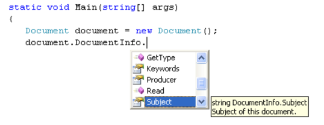

# Getting started

## Development environment

PDFControls.NET has been compiled for Microsoft .NET Framework 2.0. The assembly is supported on Microsoft .NET Framework 2.0 and up.

#### 32-bit and 64-bit

The assembly of PDFControls.NET 2.0 is platform independent, and can be used on 32-bit machines as well as on 64-bit machines.

#### Dependencies

PDFControls.NET does not depend on any third-party product other than the Microsoft .NET platform. It consists of just a single assembly.

The Microsoft .NET framework may be redistributed. It can be included in the installer for any product. For more information please read "<a href="https://msdn.microsoft.com/en-us/library/xak0tsbd(en-US,VS.80).aspx" title="Optional alternate text">Redistributing the Microsoft .NET Framework</a> " at the <a href="http://msdn.microsoft.com/" title="Optional alternate text">Microsoft MSDN website</a> .

#### Deployment

PDFControls.NET is fully compatible with the <a href="https://support.microsoft.com/en-us/kb/326355" title="Optional alternate text">XCopy deployment</a> principle of .NET. This means that installing PDFControls.NET is as simple as copying the single assembly to the installation folder of your application.

Although it is possible, there is no need to install PDFControls.NET in the <a href="https://msdn.microsoft.com/library?url=/library/en-us/cpguide/html/cpconglobalassemblycache.asp" title="Optional alternate text">GAC (Global Assembly Cache)</a> .

#### Visual Studio .NET IntelliSense (C#/VB.NET)

The PDFControls.NET 2.0 installation includes the XML document file TallComponents.PDF. Controls.WinForms.xml which is generated from our C# comments. If this file is in the same folder as the TallComponents.PDF.Controls.WinForms.dll that is referenced from your project, PDFControls.NET documentation is added to Visual Studio .NET IntelliSense as shown in the following figure.

  
**Visual Studio .NET code IntelliSense**
 

## Sample Applications

Each edition contains its own set of code samples. These can found in the “Code Samples” folders that are present in both the “Professional Edition” and the “Standard Edition” folder.

#### Standard Samples

The standard edition contains the following samples in the “Code Samples – GUI” folder.
&nbsp;<ul><li>
SimpleViewer: implements a very basic viewer that allows one to open a PDF and view it. The viewer allows scrolling. Pages can be panned by dragging. Clicking on internal page links will have the viewer navigate to that page.</li><li>
BookmarksViewer: implements a small application that allows one to open a PDF document. It has two panes. The left pane shows the bookmarks of a PDF document, provided that it has any. The right pane shows the document itself. Clicking on a bookmark will have the right pane jump to the corresponding page.</li><li>
ThumbnailsViewer: implements a small application that allows one to open a PDF document. It has two panes. The left pane shows thumbnails of the pages in the document. The right pane shows the pages at their actual size. Clicking on a thumbnail will have the right pane jump to that page. Red squares in the left pane indicate which pages are visible in the right pane. The layout of the thumbnails will adapt to the width of the left pane.</li><li>
Reader: implements a PDF reader, somewhat similar to Adobe Reader. The reader has two panes. The right pane shows the pages of the document. The left pane has 3 tabs, which show the bookmarks, the thumbnails or the layers of the document. Various modes are supported that change the way that clicking and dragging work. Amongst others, it is possible to select text, to zoom in and out, to search for text, and print documents.</li><li>
PrintDialog: implements a custom printing dialog. PDFContols.NET incorporates a printing dialog (in English) that allows a user to set a number of common printing options. A custom printing dialog allows one to create a localized version, and it allows one to limit or extend the options that a user may control. This sample shows how this can be done.</li><li>
LinkClickHandler: shows how to execute custom code when a user clicks a link in the PDF file. Please note that PDFControls.NET will not automatically follow URL’s, so if you want to allow this, please have a look at this sample.</li><li>
BookViewer: shows how to use a slightly modified page layout.</li></ul>&nbsp;
Next to these samples, there is also a “PDFReaderControls 1 Compatibility” folder. This folder contains:
&nbsp;<ul><li>
The original PDFReaderControls.NET 1 Reader sample:</li><li>
An assembly that implements many PDFReaderControls 1 API calls onto the new PDFControls 2 API. The sources of this assembly have been included in the TallComponents.PDF.ReaderControls subfolder.</li></ul>&nbsp;
This folder mainly serves a starting point for upgrading an existing PDFReaderControls 1 application to PDFControls 2. Please also see part three of this guide. On the other hand, the sources that implement the old API on top of the new one serve as an example by themselves.

#### Professional samples

The professional edition includes the same samples as the standard edition in its “Code Samples – GUI” folder, but it complements these with a number of additional samples that are related to the additional functionality of the professional edition. In addition, it has a “Code Samples – PDF Processing” folder that contains various example console applications for manipulating PDF files.

The samples in the “Code Samples – PDF Processing” are fairly self-explanatory. When run, each of these samples will automatically perform a particular task, which is documented in the samples themselves.

The extra samples in “Code Samples – GUI” are:
&nbsp;<ul><li>
BeepExtension: puts a green border around text fields, and a red one around other annotations. Clicking in an annotation will pop up a message box.</li><li>
HoverHighLight: shows a document with three fields. It will highlight the first field with a green border when the cursor hovers over one of the other fields.</li><li>
AdditionalSimpleInteractor: shows how to place a custom interactor (a control) on each page of a PDF document, next to the ones that are automatically created for PDF annotations. The sample creates an interactor that allows one to rotate a page.</li><li>
AdditionalControlIntertactor: does the same as ExtraInteractor, only now the sample creates the interactor by encapsulating a standard WinForms button. A difference with the ExtraInteractor sample, is that WinForms controls do not support rotated representations of themselves.</li><li>
CustomDateTimeInteractor: uses a WinForms MonthCalendar control to create a custom control for a PDF DateTime field. Note that the control “sticks” to the page without any additional code.</li><li>
ContextMenu: adds a context menu that allows text from a text field to be copied and pasted.</li><li>
HideAnnotations: toggles both the visibility as well as the interactive state of all annotations.</li><li>
StrikeThrough: allows occurrences of the word “the” to be struck through. This is implemented by adding a TextMarkup annotation. Clicking again will remove the strike-through. This functionality is maintained for saved files.</li><li>
DragPages: opens pages at a slightly reduced zoom, and allows pages to be reorder by dragging.</li></ul>&nbsp;
Note that the professional versions of the standard samples are virtually the same in terms of coding, but not in terms of functionality. The professional versions allow form fields to be filled in, as well as saving. The professional version of the Reader sample also allows annotations to be selected and manipulated (resizing and moving).

Further reading
&nbsp;<ul><li>
Topic "<a href="http://msdn2.microsoft.com/en-us/library/xak0tsbd(en-US,VS.80).aspx" title="Optional alternate text">Redistributing the Microsoft .NET Framework</a> " at the <a href="https://msdn.microsoft.com/en-us/default.aspx" title="Optional alternate text">Microsoft MSDN site</a> .</li><li>
Topic "https://msdn.microsoft.com/library?url=/library/en-us/cpguide/html/cpconglobalassemblycache.asp" at the <a href="https://msdn.microsoft.com/en-us/default.aspx" title="Optional alternate text">Microsoft MSDN site</a> .</li></ul>&nbsp;
