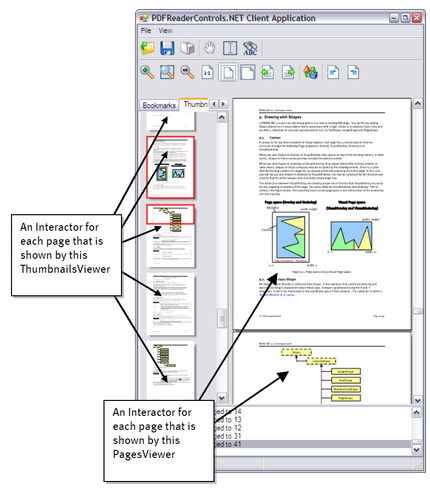
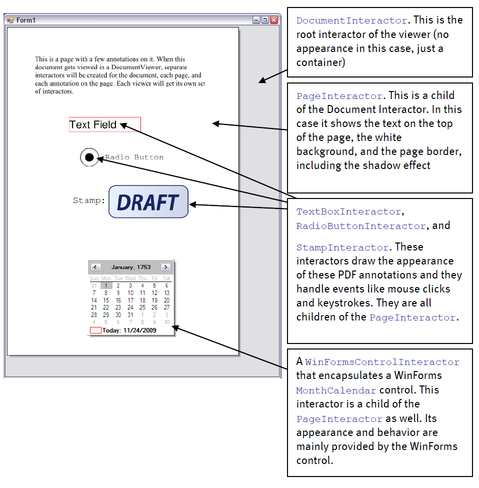

# Interactors

The professional edition of PDFControls.NET 2 introduces the concept of Interactors. In short, the interactor class captures GUI elements. This not only includes PDF widgets, but also the pages that are shown by a PagesViewer instance, and even non-PDF elements like windows controls and bitmaps. The concept of an Interactor is related to that of a Control in WinForms and a GUIElement in WPF. Interactors have two main tasks:
&nbsp;<ul><li>
They provide the appearance of a GUI element.</li><li>
They provide the behavior of a GUI element (such as handling of mouse clicks and keystrokes).</li></ul>&nbsp;
A viewer is basically a (WinForms) control that shows a number of Interactors. Interactors are not shared among viewers. They belong to a single viewer. The figure below shows a PagesViewer and a ThumbnailsViewer that each have their own set of page interactors for showing the pages of a PDF document. Some of the pages are shown by both viewers. If so, the PDF pages are shared, but the page interactors are not.

<br /><br />
**Viewers with interactors**
<br />
Interactors allow the PDFControls 2 GUI to be customized more pervasively than was possible in PDFReaderControls 1. There are various reasons why we have introduced a separate class for GUI elements, next to the PDF-specific classes – like pages and widgets - that already existed in PDFReaderControls 1.
&nbsp;<ul><li>
PDF-specific classes are tied to one particular document. A single document however, may have multiple simultaneous views. This is the case for example when both the thumbnails viewer and the pages viewer are showing the same document simultaneously. Both viewers will need separate Interactor instances to represent the document and its pages.</li><li>
An Interactor forms a natural place to accommodate GUI features that go beyond the ones that have been defined in the PDF specification. An Interactor for example, defines a VisibleRectangle that tells which part is visible in the Viewer at a particular moment.</li><li>
It is desirable to treat all GUI elements similarly, without a distinction between PDF elements like pages and widgets, and windows elements like controls and bitmaps.</li></ul>&nbsp;
&nbsp;<table><tr><th> Note</th></tr><tr><td>The main reason for having Interactors and not just WinForms controls is that WinForms controls are too limited to represent all possible PDF elements.</td></tr></table>

## Hierarchy

Each Interactor can hold any number of child interactors. A viewer basically only shows a single root Interactor, from which all other interactors are reachable.


By default, when a PDF document is opened and associated with a viewer, an Interactor hierarchy gets constructed for that viewer that follows a similar structure as the PDF document itself:
&nbsp;<ul><li>
At the top level, we have the DocumentInteractor. It offers a view on the entire document.</li><li>
Each DocumentInteractor contains a collection of child PageInteractor instances. Each PageInteractor shows a particular PDF page.</li><li>
Each PageInteractor in turn, contains a collection of child AnnotationInteractor instances. Subclasses of these include WidgetInteractor, and LinkInteractor. These are subclassed further into CheckBoxInteractor, ListBoxInteractor, etc.</li></ul>&nbsp;
The interactor hierarchy plays an important role for both appearance and behavior:
&nbsp;<ul><li>
Child interactors are always drawn on top of their parent. So, the hierarchy specifies a z-order.</li><li>
By default, if a mouse click occurs over a child interactor, it will be handled by the child, and not the parent. So basically the child hides the parent at that position, which is consistent with drawing the child on top of the parent.</li></ul>&nbsp;
The order in which the children are stored in the Interactor.Childs property plays a similar role, but this only comes into play when child interactors overlap:
&nbsp;<ul><li>
The children are drawn in the order that they are stored in the collection. As a result, the last child is drawn on top of all the other children.</li><li>
If a mouse event occurs over two overlapping children, it will get handled by the child that is stored after the other.</li></ul>&nbsp;
<br /><br />
**Interactors at various levels**
<br />
It is possible to customize this hierarchy further. One may for example encapsulate a windows GUI element (like a control) in a “WinFormsControlInteractor” and include that in a DocumentInteractor or PageInteractor. The effect of this will be that the windows element will appear “next to” the pages in the document, and next to the annotations on the page respectively. This technique has been used in the CustomDateTimeInteractor sample.
&nbsp;<table><tr><th> Note</th></tr><tr><td>Often the children of an interactor are placed inside the bounds of their parent. This is not mandatory however.</td></tr></table>

## Interactor Factories

Interactors are normally created automatically when a document gets opened in a viewer. By default, the viewer will create a number of standard interactors that provide common behavior.


One can see this in the Reader sample. All the behavior that it provides is basically implemented by the standard interactors that PDFControls.NET creates automatically. As a result, one will hardly have to deal with interactors if one just needs such standard behavior.


There is a second reason for creating interactors automatically. Interactors need to be created lazily. If we were to create all interactors for a large document up front, we would quickly run out of resources. We use the automatic interactor creation mechanism to only create interactors when needed, which basically means: when they must be shown on the screen.


At the same time, we also want clients to be able to create their own interactors in order to customize the GUI. In order to do this, we have introduced Interactor factories. A document viewer has three of such factories:
&nbsp;<ul><li>
DocumentInteractorFactory: a factory that creates an instance of a DocumentInteractor when a document gets opened by the viewer.</li><li>
PageInteractorFactory: a factory that creates instances of a PageInteractor for each page in the document.</li><li>
AnnotationInteractorFactory: a factory that creates instances of an AnnotationInteractor for each annotation on a visible page.</li></ul>&nbsp;
Each factory has a number of virtual methods that each creates a particular type of interactor. In order to create a custom interactor, one will need to subclass the appropriate factory and override one or more of the “create” methods so that it creates the modified interactor. This factory will then need to be assigned to the proper factory property of the viewer.


For details, please see the chapter on factories. The following sections will focus on the interactors itself.


## Coordinates

Each Interactor defines its own coordinate system and all contained interactors have a position that is relative to this coordinate system. As a result, if one moves an interactor, all contained interactors will move with it as if they are attached to their parent.


Each interactor has its origin at its upper left corner, with the x-axis pointing to the right, and the y-axis pointing down. This corresponds to the coordinate system that Windows uses for its controls and forms. Please note that this is also true for page interactors, even though in PDF, pages have their origin at their lower left corner, with the y-axis pointing up. In other words: even though the location of PDF widgets are specified in PDF page coordinates, the corresponding widget interactors will be placed in the coordinate system of the PageInteractor.


## Dimensions

Within its own coordinate system, the dimensions of an interactor are roughly defined by the following properties:
&nbsp;<ul><li>
Width: each concrete interactor defines a read-only width. The width is not settable, because it is normally derived from an underlying logical object (such as a PDF annotation, or a PDF page). In order to change the width, just change the dimensions of that object.</li><li>
Height: each concrete interactor defines a read-only height. This is similar to the Width.</li></ul>&nbsp;
This does not mean that all interactors are rectangular. The values above are just basic bounds in which the interactor will be drawn.


## Transforms

Interactors have a width and a height, but they do not have x- and y-properties that defined their position. Instead, the location of an interactor is defined by means of a Transform, which is applied relative to its parent.


For example, if you want to position an interactor at (10, 20) you can use the following code.


```
Interactor.Transform = new TranslateTransform(10, 20);
```

Many other transformation are possible, next to positioning an interactor. The Transform class has the following subclasses:
&nbsp;<ul><li>
IdentityTransform: the identity transformation, i.e. this transformation has no effect.</li><li>
TranslateTransform: this moves (translated) the interactor over a particular distance in the x and y direction.</li><li>
ScaleTransform: this transform scales the interactor in the x and y direction.</li><li>
RotateTransform: this transform rotates the interactor. The angle is specified in degrees. For interactors the rotation is clockwise (The direction of the rotation depends on the coordinate system. If the origin is at the top left corner - with the y-axis going down -, the rotation will be clockwise. This is the case for interactors (and WinForms/WPF). If the origin is at the bottom left corner - with the y-axis going up -, the rotation will be counter-clockwise. This is the case for PDF shapes).</li><li>
SkewTransform: this transform skews the interactor.</li><li>
TransformCollection: a transformation that consists of a sequence of other transformations. A TransformCollection provides access to the separate transformations that it has been constructed of.</li><li>
MatrixTransform: a 2D transformation that is defined by a 3-by-3 affine matrix. It is possible to append transformations to an existing MatrixTransform, but in contrast to a TransformCollection, these transformations cannot be extracted from the resulting MatrixTransform. The advantage of a MatrixTransform is that it does not store all the transformations that have been appended, which makes it more efficient in situations that existing transformations get updated often.</li></ul>&nbsp;
Interactors take the same approach as WPF. A transform does not change the coordinate system, but it specifies the transformation that is applied to the interactor. If one takes a coordinate within an interactor, and applies its transform to it, one will obtain the corresponding coordinate in the coordinate system of the parent.


Please note that the order in which transformations are applied is important. In particular this should be taken into account when adding transforms to a TransformCollection, and when appending transformations to a MatrixTranform. As interactors use the same approach as WPF, the visual studio designer can be used to determine which order is correct.
&nbsp;<table><tr><th> Note</th></tr><tr><td>The Width and Height of interactors that have been derived from WinForms controls (i.e. instances of WinFormsControlInteractor) are derived from the width and height properties of these controls. WinForms controls however have their width and height specified in pixels. They cannot rotate, and resizing may lead to strange effects. To avoid problems when an interactor gets transformed, the WinForms controls on it will stay upright, and will not scale. This effect can be seen in the AdditionalControlInteractor sample. To keep things consistent, the Width and Height properties of the associated WinFormsControlInteracors will automatically adapt to any transformation so that they still show the correct width and height with respect to the parent interactor coordinate system.</td></tr></table>

## Appearance

The appearance of an interactor is implemented by its OnPaint() method. This is similar to the OnPaint() method in WinForms. Any time that a viewer needs the appearance of a particular interactor, it’s OnPaint() method will be invoked automatically:
&nbsp;<ul><li>
OnPaint(PaintEventArgs): this virtual method provides the basic appearance of the interactor. It will be invoked before drawing any child interactor. A GDI graphics instance will be provided as part of the PaintEventArgs, and it will use the coordinate system of the interactor, i.e. the origin is at the top left of the interactor. Painting will be clipped to the width and height of the interactor. If one overrides this method one can invoke base.OnPaint() to draw the base appearance and paint additional marks before or after. But it is also possible to avoid calling base and paint a completely new appearance.</li></ul>

#### Special Cases

Next to these, there are a few virtual painting methods that deal with special cases:
&nbsp;<ul><li>
OnPaintOver(PaintEventArgs): This virtual method can be used to draw additional marks over the regular appearance of this interactor as well as over all its children. Typically, it will be used to add some highlighting, for example when an interactor gets selected. This method gets invoked after drawing all child interactors. The provided GDI graphics instance will use the same coordinate system as for OnPaint(), but painting will not be clipped.</li><li>
OnPaintShadow(PaintEventArgs): This virtual method can be used to draw a shadow effect for the current interactor. It will be invoked before painting any other part of the interactor (The shadow of all children of some parent will be drawn before any of the children gets drawn). The provided GDI graphics instance will use a coordinate system that is slightly translated compared to the OnPaint() variant. This translation is specified by the ShadowDistance property of the interactor, and indicates a translation in the parent coordinate system (so that transformations of the interactor do not influence the location of the shadow with respect to the parent).</li><li>
OnPaintDrag(PaintEventArgs): paints a representation of the interactor when it is being dragged. The provided graphics instance provides a coordinate system that represents the current location of the dragged interactor.</li></ul>

## Behavior

The behavior of an interactor is controlled by means of a number of virtual methods, which resemble the methods that are present in WinForms and WPF. These are methods like “OnMouseDown”, “OnKeyDown”, etc. They will be invoked automatically when a certain interactive event occurs, and then they should handle this event. We will have a look at these methods below, grouped by the type of event (see also the chapter on events).


Please note that in order for an interactor to react to user input at all, its IsInteractive property must be set to true (also see the HideAnnotations sample).


#### Focusing

If an interactor has the focus, all GUI events that do not specify a location will go to that interactor. An interactor can get the focus in two ways.
&nbsp;<ul><li>
By assigning the interactor to DocumentViewer.FocusInteractor.</li><li>
By clicking on an (interactive) interactor. Also see the section on mouse event handling.</li></ul>&nbsp;
During a focus change, the following virtuals will be invoked.
&nbsp;<ul><li>
OnGotFocus(EventArgs): this method will be invoked after the interactor has received the focus. This allows the interactor to prepare. Text fields for example, will typically start a blinking cursor.</li><li>
OnLostFocus(EventArgs): this method will be invoked after an interactor has lost the focus. This allows the interactor to finalize. Text fields for example, will typically stop showing a blinking cursor.</li></ul>&nbsp;
&nbsp;<table><tr><th> Note</th></tr><tr><td>It is possible to reassign the focus during OnGotFocus or OnLostFocus. If an override calls base.OnGotFocus or base.OnLostFocus, it is advised to check afterwards whether the interactor still has (lost) the focus. If the focus gets reassigned during OnLostFocus, this new value will prevail over any focus action that might have triggered the OnLostFocus invocation.</td></tr></table>

#### Keyboard handling

There are two ways in which an interactor will receive keystrokes. First of all, if an interactor has the focus, all keystrokes will go to that interactor. And secondly, it is possible to send text to a particular interactor by invoking the SendText method of the interactor.


Keystrokes (including SendText) will lead to the invocation of the following virtuals:
&nbsp;<ul><li>
OnKeyDown(KeyBoardEventArgs): invoked when a key is pressed while this interactor has the focus. If the key is held down, multiple invocations of OnKeyDown will occur.</li><li>
OnKeyUp(KeyBoardEventArgs): invoked when a key is released while the interactor has the focus.</li></ul>&nbsp;
Please note that unlike WinForms, there is no separate KeyStroke event.


#### Mouse Moves

While a user is moving the mouse over a viewer the following methods will be invoked.
&nbsp;<ul><li>
IsOver(x, y): This method will only be invoked when the mouse pointer is inside the bounds that are given by the Width and the Height of the interactor. IsOver() should return true for each coordinate within this area that is able to process mouse events. No further mouse handling methods will be invoked for any coordinate for which IsOver() returns false. Mouse handling can be turned off entirely for a particular interactor by letting IsOver() return false for the entire area. In other words: IsOver() refines the clickable area of an interactor, and together with OnPaint(), it defines its shape. By default, IsOver(x, y) returns true.</li><li>
OnMouseEnter(EventArgs): Invoked when the mouse pointer enters the area that is defined by IsOver.</li><li>
OnMouseLeave(EventArgs): Invoked when the mouse pointer leaves the area that is defined by IsOver().</li><li>
OnMouseMove(MouseEventArgs): Invoked regularly when the mouse pointer moves over the interactor. The MouseEventArgs can be inspected to determine the exact location of the mouse pointer.</li><li>
OnMouseHover(EventArgs): Invoked shortly after OnMouseEnter, except when OnMouseLeave has been invoked before that. By default, this is used as a trigger for showing tooltips.</li></ul>

#### Mouse Clicks

If a user clicks on an interactor (i.e. on the area defined by IsOver), the following methods are invoked:
&nbsp;<ul><li>
OnMouseDown(MouseEvenArgs): Invoked at the moment that the user presses a mouse button. At this point, the mouse button is still down. The default implementation of OnMouseDown() will set the focus to this interactor if the left mouse button was pressed.</li><li>
OnMouseUp(MouseEventArgs): Invoked at the moment that the user releases a mouse button.</li><li>
OnMouseClick(MouseEventArgs): Invoked when the user clicks in this interactor. This will happen at the moment that the user releases the mouse button, but only if the mouse button also went down in this interactor. The latter may not be case if the mouse was dragged before releasing. OnMouseClick() will be generated shortly before OnMouseUp().</li><li>
OnMouseDoubleClick(MouseEventArgs): Invoked when the user double-clicks in this interactor. This will happen at the moment that the user presses the mouse button for the second time. This will only happen if the previous mouse-down and mouse-up also occurred in this interactor (also see OnMouseClick()). OnMouseDoubleClick() will be generated shortly after the second invocation of OnMouseDown().</li></ul>

#### Dragging

PDFControls.NET 2 supports dragging in various ways. This will be explained in a separate chapter.


