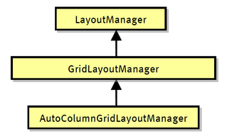
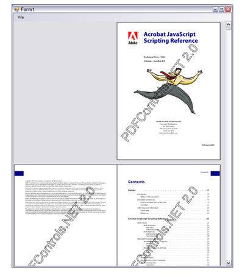

# Page layout

The page layout of a viewer is controlled by layout managers. PDFControls.NET defines a few standard layout managers that can be used for the most common page layouts:

<br /><br />
**Layout Manager classes**
<br />
&nbsp;<ul><li>
LayoutManager: base layout manager class. All layout managers derive from this class.</li><li>
GridLayoutManager: this layout manager orders all pages in a grid. Its constructor gets passed the number of columns that are required. GridLayoutManager(1) places all pages in a single column, the first page on top, and the last one on the bottom. GridLayoutManager(2) basically shows all pages in a “two-up” layout. The Indent property specifies how many columns the first page must be shifted to the right, provided that this value is smaller than the number of columns. This can be used in “two-up” layouts to make sure that facing pages are placed next to each other.</li><li>
AutoColumnsGridLayoutManager: this layout manager is a subclass of the GridLayoutManager. Instead of using a fixed number of columns, this layout manager dynamically adapts the number of columns to the visible area of the viewer, with a minimum of 1. The ThumbnailsViewer uses this layout manager by default.</li></ul>&nbsp;
The use of these layout managers for laying out pages is fairly simple. One just needs to assign an instance of the proper layout manager to the LayoutManager property of the viewer.
&nbsp;<table><tr><th> Note</th></tr><tr><td>The Professional edition also defines a PageLayoutManager and an AnnotationLayoutManager. These are specialized layout managers that are only useful in combination with interactors. This will be explained later.</td></tr></table>

## GridLayoutManager

The GridLayoutManager has the following properties:
&nbsp;<ul><li>
ColumnCount: specifies the number of columns.</li><li>
Spacing: the minimum space between pages. This value is given in points (i.e. the spacing in terms of pixels depends on the zoom factor).</li><li>
Margin: the minimum space around all pages. This value is given in points.</li><li>
Indent: specifies the number of columns that must be skipped on the first row before placing the first page.</li></ul>&nbsp;
The BookViewer sample uses the GridLayoutManager to show all pages in the way they would be when read in a book.


```
public Form1()
{
   InitializeComponent();

   GridLayoutManager bookLayout = new GridLayoutManager(2);
   bookLayout.Indent = 1;
   bookLayout.Spacing.Left = 0;
   bookLayout.Spacing.Right = 0;
   bookLayout.Spacing.Top = 30;

   pagesViewer1.LayoutManager = bookLayout;
   pagesViewer1.ZoomFactor = 0.5;
}
```

Implementing a simple “book layout”.

<br /><br />
**Book layout**
<br />

## Custom Layout Managers

The professional edition allows the definition of custom layout managers. In order to do this, it is sufficient to override the Arrange method of the layout manager and have it place the provided interactors at the appropriate position.


