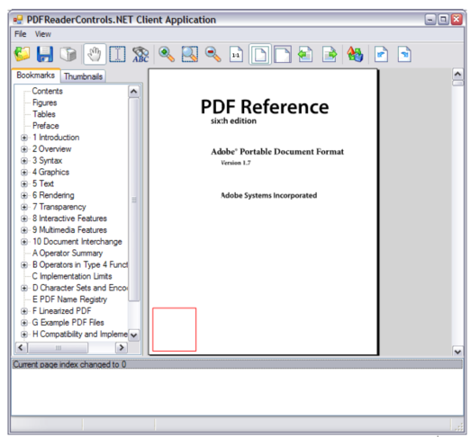

# Upgrading the Professional Edition


## Account for removed classes, enumerations and delegates

A number of classes, enumerations and delegates that were previously in the namespace TallComponents.PDF.ReaderControls have been removed altogether. The functionality that these classes provided has either been taken over by de new object model, or can be implemented in it. The table below lists all classes that have been removed. For simplicity, we have left out the event “handler” classes.


## PagesViewer

This object incorporates the most changes, and will be the most complex to upgrade. Much functionality that previously existed in the PagesViewer class has moved to the StandardPagesViewer class. The PagesViewer class itself has been reduced to a more bare-bones version that is now more suitable for creating custom viewers (of which the StandardPagesViewer is basically an example).


The sections below will only consider methods and properties that the StandardPagesViewer does not provide and that do not exist in the standard edition either.


#### AnnotationGotFocus and AnnotationLostFocus

See the compatibility sources. If one needs these events, one can add a layer to each annotation that overrides OnGotFocus and OnLostFocus and have it fire these events.


Note however that at that point, the focus has already been obtained or lost. This means that focusing cannot be cancelled here. If one wants to avoid that an annotation gets the focus, please clear the IsFocussable flag of the interactor. It is also possible to reassign the focus.


#### AnnotationMouse… events

See the compatibility sources. If one needs these events, one can add a layer that overrides the needed OnMouse… event handler and have it fire the corresponding event.


#### BeforeAnnotation… and AfterAnnotation… events

Please see the compatibility sources. If one needs the “move” events, one can add a layer to each annotation and override OnDragBegin and OnDragEnd and have these raise these events. If one needs the “resize” events, one can subscribe to the resize events of the ResizeLayer that is added to each annotation by default.


#### DocumentRectangle

See PagesViewer.DocumentInteractor.Rectangle instead.


#### HidePopup and ShowPopup events

These events no longer exist. In PDFControls.NET 2, if a markup annotation has a Popup and it gets opened, the CreatePopupInteractor method of the AnnotationInteractorFactory will be invoked. This allows one to create a custom popup interactor. If needed, one can raise a show/hide event in overrides of OnAttached and OnDetached.


#### PageRectangles

This property no longer exists. Also see the corresponding section for the standard edition. In the professional edition it is easier to obtain the page rectangles: the following code will obtain the rectangle that a PageInteractor occupies in the coordinate system of its DocumentInteractor. If you do this for all PageInteractors, you will obtain all “page rectangles”.


```
pageInteractor.Transformation.Transform(pageInteractor.Rectangle);
```

Code sample: Obtaining page rectangles.


Also see the remarks on DocumentToPage and PageToDocument.


#### PrePaint, PaintReady and PostPaint events

Although the PagesViewer class does no longer provide these events, it is easy to implement them by overriding OnPaint on the PagesViewer.


```
protected override void OnPaint(System.Windows.Forms.PaintEventArgs e)
  {
     if (PrePaint != null)
        PrePaint(this, e);

     base.OnPaint(e);

     if (PostPaint != null)
        PostPaint(this, e);

     if (PaintReady != null  && !Painting) 
        PaintReady(this, new EventArgs());
  }
```

Code sample: Prepaint, postpaint and paintready events.


Notice however that there will be less need in general to fire these events. In PDFReaderControls.NET 1 they were often used to draw additional graphics on a page. In PDFControls 2 this can be done in a much easier way by overriding the OnPaint method of the appropriate interactor. The OnPaint method of the interactor will always be invoked with the origin of the Graphics object set top the top left corner of the interactor. This reduces the need for complex coordinate system transformations. In general, this is also more efficient, because the painting code will only be invoked when that particular interactor is visible.


#### SelectedAnnotations, SelectedGlyphs and SelectedText

The current selection of the PagesViewer is maintained by its Selection property. This is a list of selected interactors. To obtain all selected annotations, just extract all AnnotationInteractors in Selection, and look up their Annotation property.


In addition, the Selection object provides a Glyphs and a Text property. These will return the text (and glyphs) of the currently selected interactors, provided there exists a conversion to these types.


The selection can be changed by adding or removing interactors. In this way, the set of selected annotations can be changed.


It is also possible to assign a value to Selection.Text. This will send a KeyBoardEvent to all interactors in the selection.


#### Selected… events

The SelectedAnotationsRightClicked event and the SelectedTextRightClicked events no longer exist. Instead, the PagesViewer has a Selection property that holds the current selection. If the mouse button goes down over the selection (whatever it may hold) the Selection class will raise a PreviewMouseDown event. An event handler can be used to fire the original events as follows:


```
void Selection_PreviewMouseDown(
  object sender, PreviewEvent <MouseEventArgs> previewEvent) 
{
  MouseEventArgs e = previewEvent.Event;

  if (e.Button == System.Windows.Forms.MouseButtons.Right)
  {
    AnnotationInteractor annotationInteractor = sender as AnnotationInteractor;

    if (annotationInteractor != null && SelectedAnnotationsRightClicked != null) 
    {
      SelectedAnnotationsRightClicked(sender,
       new SelectedAnnotationsRightClickedEventArgs(
         annotationInteractor.Annotation));
    }
    else if (Selection.Text.Length != 0 && SelectedTextRightClicked != null) 
    {
      // If the mouse went down in the selection and there is at least some
      // selected text, we raise this the SelectedTextRightClicked event.
      SelectedTextRightClicked(sender, new SelectedTextRightClickedEventArgs());
    }
  }
}
```

Code sample: SelectedAnnotationsRightClicked and SelectedTextRightClicked


The SelectedTextChanged event can be implemented by monitoring the Invalidated event of the selection, and checking whether the text selection has changed.


```
void Selection_Invalidated(object sender, InvalidatedEventArgs e)
{
  string currentTextSelection = SelectedText;

  if (SelectedTextChanged != null   && _selectedText != currentTextSelection) 
  {
    SelectedTextChanged(this, e);
  }
  _selectedText = currentTextSelection;
}
```

Code sample: SelectedTextChanged event


#### SetFocus

The SetFocus call has been removed. Instead, the PagesViewer has a FocusInteractor property that can be used to set the focus to a particular interactor, as well as a FocusAnnotation property that can be used to set the focus to a particular annotation.


#### ShowOverflowMarker

The StandardPagesViewer implements this flag. Note however that ShowOverflowMarker used to be false by default in version 1, but in version 2 TextBoxInteractor.ShowOverflow defaults to true.


## ThumbnailsViewer

The Thumbnailsviewer now has DocumentViewer for its base class, just like PagesViewer. This means that the thumbnailsviewer has become more versatile. There are only a few properties and events that no longer exist. For these, the same applies as for the corresponding properties and events in the PagesViewer class.


#### ThumbnailsRectangles

See the remarks on PagesViewer.PageRectangles.


#### MouseUp, MouseMove and MouseDown events

See the remarks about these events in the PagesViewer.


#### PostPaint event

See the remarks about the PostPaint event in the PagesViewer.


## BookmarksViewer

The BookmarksViewer class has not been changed.


## PrintSettings

For the PrintSettings in the professional edition, the same applies as for the standard edition. Please see the corresponding section of the previous chapter.


## CustomAnnotation

PDFReaderControls.NET 1.1 offered the ability to create a custom annotation that could be added to the CustomAnnotations collection of a page. With this, one could create a custom “control” on a page. This annotation was different from other PDF annotations, because it only has an appearance on screen. It could not be written to the PDF file or printed.


With the arrival of interactors, this mechanism for creating a custom control has become obsolete. Instead, one can add a custom child interactor to a PageInteractor.


Note that an interactor has a similar interface as the old CustomAnnotation. Both allow a number of virtuals to be overridden in order to define a particular look and behavior. Both have methods like OnPaint and OnMouseDown. There are also differences. The arguments for various virtuals are different, and some of these have different names.


To make the transition easier, the compatibility sources contain a CustomAnnotation class that has a similar API as the old one, and that is defined in the same namespace (TallComponents.PDF.Annotations). In addition, we have added a CustomAnnotationInteractor that provides the GUI appearance for a CustomAnnotation. These classes can be used as follows:
&nbsp;<ul><li>
Let your existing custom annotation classes derive from the new CustomAnnotation class. This should happen automatically if the compatibility sources are included.</li><li>
Create a new CustomAnnotationInteractor for the custom annotation, and add it as a child to the appropriate PageInteractor. One way to do this is via the PagesViewer.PageInteractorCreated event. See the code sample below.</li><li>
If the CustomAnnotation maintains state, please make sure that you keep a reference to it somewhere, and (re-)use it when the interactors of a page get (re-)created. Previously, the custom annotations were stored in a page, which persisted during the lifetime of a document. Interactors however live much shorter, and may get garbage collected after a page becomes invisible.</li></ul>&nbsp;
The code below shows how this can be done. Please note that it creates a new CustomAnnotation each time that the PageInteractor needs to recreate its child interactors.


```
// Get notified when a page interactor gets created.
pagesViewer.PageInteractorCreated += pagesViewer_PageInteractorCreated;

…
void pagesViewer_PageInteractorCreated(object sender,
    TallComponents.Interaction.WinForms.Events.InteractorEventArgs e)
{
  PageInteractor pageInteractor = e.Element as PageInteractor;
  if (pageInteractor != null  && pageInteractor.Page.Index == 0)
  {
    // Get notified when page interactor 0 has (re-)initialised
    // its annotation interactors.
    pageInteractor.AnnotationInteractorsCreated +=
                    pageInteractor_AnnotationInteractorsCreated;
  }
}

void pageInteractor_AnnotationInteractorsCreated(object sender, EventArgs e)
{
  PageInteractor pageInteractor = sender as PageInteractor;

  if (pageInteractor != null)
  {
    CustomAnnotation customAnnotation = new MyCustomAnnotation();
    customAnnotation.Width = 100;
    customAnnotation.Height = 100;
    customAnnotation.Left = 10;
    customAnnotation.Bottom = 10;

    pageInteractor.Childs.Add(new 
                        CustomAnnotationInteractor(customAnnotation));
  }
}

class MyCustomAnnotation : CustomAnnotation
{
  protected override void OnPaint(Graphics graphics)
  {
    // The passed graphics instance has its origin at the bottom
    // left of the page.
    graphics.DrawRectangle(System.Drawing.Pens.Red,
             (float)Left, (float)Bottom, (float)Width, (float)Height);
  }
}
```

Code sample: Creating an interactor for a CustomAnnotation instance.


The code above produces a red rectangle at the first page of the document that corresponds to the location of the custom annotation:

<br /><br />
**Creating an Interactor for a CustomAnnotation instance.**
<br />