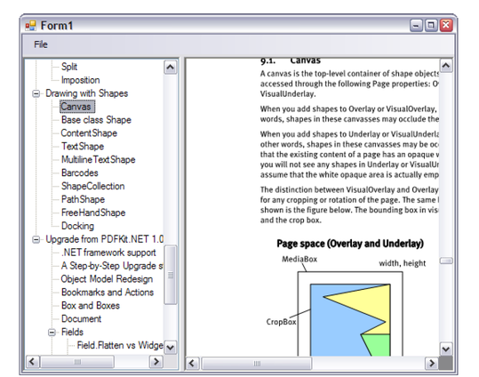

# Viewing

In essence, PDFControls.NET provides a number of WinForms Viewer Controls that allow one to View PDF documents. The professional edition adds the ability to manipulate and save PDF documents. The class hierarchy for the viewer controls is as follows:

<br /><br />
**Viewer class hierarchy**
<br />
These classes provide the following functionality:
&nbsp;<ul><li>
DocumentViewer: this is the base class for all viewers that show PDF documents. Next to viewing, it offers basic navigation functionality such as zooming and panning.</li><li>
ThumbnailsViewer: this is a special document viewer that shows all pages as thumbnails. If its PagesViewer property is set, it will mark the pages that are visible in the PagesViewer by means of red rectangle. In addition, clicking on a thumbnail will have the pages viewer navigate to that page.</li><li>
PagesViewer: this is a special document viewer that adds the notion of a “current” page. In contrast to the StandardPagesViewer (see below), the PagesViewer can be used in the professional edition as a basis for a highly customized viewer. As a result, the PagesViewer is often of interest in the professional edition only.</li><li>
StandardPagesViewer: this is special pages viewer that adds a number of convenient common features. These features resemble (and extend) the features of the version 1 PagesViewer. This makes it possible to easily obtain a very powerful viewer. In general however, it is more difficult to customize this viewer, as new features may conflict with existing ones. The latter however is only relevant for the professional edition.</li></ul>&nbsp;
Next to these classes there is also a BookMarksViewer class. This control does not show pages, but it shows the bookmarks that are defined in a PDF document.


## Pages Viewer

A simple PDF document viewer can be built by including a PagesViewer control in your GUI application, connecting its Document property to a Document instance, and writing a few lines of code to open PDF files. See the SimpleViewer sample:


```
using System;
using System.ComponentModel;

using TallComponents.Interaction.WinForms;

namespace WindowsApplication1
{
   public partial class Form1 : System.Windows.Forms.Form
   {
      public Form1()
      {
         InitializeComponent();
      }

      private void openToolStripMenuItem_Click(object sender, EventArgs e)
      {
         System.Windows.Forms.OpenFileDialog dialog = new 
           System.Windows.Forms.OpenFileDialog();

         if (dialog.ShowDialog() == System.Windows.Forms.DialogResult.OK)
         {
            document1.Open(dialog.FileName);
         }
      }
   }
}
```

Code sample: A simple viewer.


The code above is all that is needed to obtain a viewer that:
&nbsp;<ul><li>
Show all pages of a PDF document.</li><li>
Allows scrolling via scroll bars.</li><li>
Allows panning by dragging the mouse.</li><li>
Supports page navigation by clicking on links.</li><li>
Allows Filling out form fields (professional only)</li></ul>&nbsp;
<br /><br />
**Save changes incrementally as an update**
<br />

#### Saving

The standard edition does not allow changing or saving of PDF documents. In order to allow the professional version to save documents (including completed forms) one may add the following code. Also see the SimpleViewer sample of the professional edition.


```
private void saveAsToolStripMenuItem_Click(object sender, EventArgs e)
{
  if (document1.HasDocument)
  {
    System.Windows.Forms.SaveFileDialog dialog = new
      System.Windows.Forms.SaveFileDialog();
    dialog.Filter = "PDF documents|*.pdf";
    dialog.FileName = "test.pdf";

    if (dialog.ShowDialog() == System.Windows.Forms.DialogResult.OK)
    {
      using (FileStream file = new FileStream(dialog.FileName,
        FileMode.OpenOrCreate, FileAccess.Write))
      {
        document1.Write(file);
      }
    }
  }
}
```

Saving a modified document.


## StandardPagesViewer

The StandardPagesViewer offers a viewer that derives from the PagesViewer class. It can be used in exactly the same way as the PagesViewer, but it offers a number of common extras:
&nbsp;<ul><li>
A CursorMode. This mode controls how clicking and dragging operates. Next to a “normal” mode this includes a mode that allows one to select text (SelectText), various modes that allow one to zoom to a particular area (ZoomIn, ZoomOut, ZoomToSelection), and a mode that allows one to select and edit annotations (SelectAnnotations).</li><li>
A ZoomMode that defines whether the viewer should maintain a particular zoomed view on the document. This includes FitEntirePage and FitPageWidth.</li><li>
A TextSelectMode (when CursorMode == SelectText). This allows one to either select entire words, or separate characters.</li><li>
A ZoomFactors property and ZoomIn()/ZoomOut() methods.</li><li>
RotatePageLeft() and RotatePageRight() methods.</li><li>
The EnableAnnotations property, which enables or disables all annotations at once.</li><li>
The HighlightAnnotations property, which marks all annotations with a color when set.</li><li>
The ShowOverflowMarker property which controls whether an overflow marker is shown when there is more text in a field than it can display.</li><li>
Events that fire when annotations get resized (when CursorMode = SelectAnnotations).</li></ul>&nbsp;
&nbsp;<table><tr><th> Note</th></tr><tr><td>The StandardPagesViewer implements these features via a custom LayoutManager, and - in the professional edition -, with custom interactor factories. We do not recommend changing these for the StandardPagesViewer, as this will lead to undefined behavior.</td></tr></table>

## Thumbnails Viewer

Using a thumbnails viewer proceeds in much the same way. Note that both the PagesViewer and the ThumbnailsViewer classes derive from the same DocumentViewer class. So, one can view thumbnails by using exactly the same code as for the PagesViewer, after assigning a Document instance to the Document property of the ThumbnailsViewer.


If one also assigns a PagesViewer instance to the PagesViewer property of the thumbnails viewer, it will indicate which page is currently visible in the PagesViewer and when a user clicks on a thumbnail image, it will navigate the PagesViewer to that page.


Compile and run the ThumbnailsViewer sample to see this in action.

<br /><br />
**Screenshot of ThumbnailsViewer sample**
<br />

## Document Viewer

The DocumentsViewer is the base class of both the Thumbnails Viewer and the PagesViewer. It can be used as a rudimentary viewer of its own, although it lacks the notion of a “current page”, and thus it does not provide navigation to particular pages.


## Bookmarks Viewer

The BookmarksViewer does not show PDF pages, but it shows the bookmark tree that is defined in the document (if any). Its use is completely analogous to that of the ThumbnailsViewer.


If one assigns a PagesViewer instance to the PagesViewer property of the BookmarksViewer, it will have the PagesViewer navigate to the right page when a user clicks in a bookmark.


Compile and run the BookmarksViewer sample to see this in action. Please note that you will have to open a PDF document with bookmarks in order for the BookmarksViewer to show anything.

<br /><br />
**Screenshot of BookMarksViewer sample**
<br />