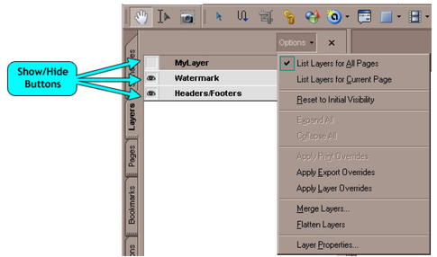

# Layers

The PDF specification allows you to group graphics objects together in layers and turn visiblity selectively on and off in any combination. This is typically used in e..g CAD drawing to show/hide levels of details. The following snapshot from the Adobe PDF Reader shows how the user can turn on/off visibility of layers.

<br /><br />
**Visibility of layers can be turned on and off**
<br />

## Basic code sample

PDFRasterizer.NET 3.0 lets you control how to render the different layers. Here is a basic code sample that shows you how to do this:


```
using (FileStream file = new FileStream(
   @"layers.pdf", FileMode.Open, FileAccess.Read))
{
   Document document = new Document(file);
   Page page = document.Pages[0];

   LayerCollection layers = document.Layers;
   // render all layers      
   foreach (LayerInfo layer in layers)
   {
      layer.Visible = true;
   }

   using (Bitmap bitmap = new Bitmap((int)page.Width, (int)page.Height))
   {
      Graphics graphics = Graphics.FromImage(bitmap);

      RenderSettings renderSettings = new RenderSettings();
      renderSettings.LayerSettings.Layers = layers;

      page.Draw(graphics, renderSettings);
      bitmap.Save(@"layers.png", ImageFormat.Png);
   }
}
```

Code sample: Control rendering of layers


## Clone Layers

The code sample above assigns document.Layers to LayerSettings.Layers by reference. This means that in principal the settings may change afterwards if a second thread modifies the document.Layers collection. To avoid this you should make clone as follows:


```
LayerCollection layers = document.Layers;
RenderSettings renderSettings = new RenderSettings();
renderSettings.LayerSettings.Layers = layers.Clone();
```

Code sample: Clone the LayerCollection


## Default behavior

If LayerSettings.Layers equals null, the layer visibility settings as stored in the document will be used. In other words, the document will be rendered equal to how e.g. the Adobe PDF Reader will show the document initially.


