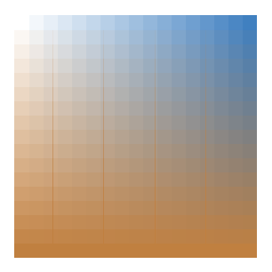

# More precise rendering

Starting with version 4.0, PDFRasterizer.NET renders much more precisely due to an overhaul of our render engine. 

The following compares the rendering of PDFRasterizer.NET 3.0, 4.0 and Adobe PDF Reader.

## Blending modes

Pdfrasterizer4 has implemented all blending modes in contrast with Pdfrasterizer3. It is possible to see differences in rendering on the next examples.

Every PDF has two images which overlaps. Image with blue vertical strips with different opacity is rendered in the background. Most left strip is fully transparent most right strip is opaque. Rest strips are semitransparent with growing opacity from left to right.

Foreground image is similar to previous one. It contains horizontal brown strips with different opacity growing from top to down. Different blending mode are used in next examples.

- **Color** ([PDF](/guide/pdfrasterizer4/medi](/guide/pdfrasterizer4/media/a/comp-rast/BM_Color.pdf))

<table>
	<tr>
		<td>3.0</td>
		<td>4.0</td>
		<td>Adobe Reader</td>
	</tr>
	<tr>
		<td>
		<td></td>
		<td></td>
	</tr>
</table>

| Rasterizer 3 | Rasterizer 4 | Adobe Reader |
| :----------: | :----------: | :----------: |
|  |  |  |

- **Color Burn** ([PDF](pdfrasterizer4/content/guide/pdfrasterizer4/media/comp-rast/BM_ColorBurn.pdf))

| Rasterizer 3 | Rasterizer 4 | Adobe Reader |
| :----------: | :----------: | :----------: |
|  |  |  |

- **Color Dodge** ([PDF](/guide/pdfrasterizer4/media/comp-rast/BM_ColorDodge.pdf))

| Rasterizer 3 | Rasterizer 4 | Adobe Reader |
| :----------: | :----------: | :----------: |
|  |  |  |

- **Darken** ([PDF](/guide/pdfrasterizer4/media/comp-rast/BM_Darken.pdf))

| Rasterizer 3 | Rasterizer 4 | Adobe Reader |
| :----------: | :----------: | :----------: |
|  |  |  |

- **Difference** ([PDF](/guide/pdfrasterizer4/media/comp-rast/BM_Difference.pdf))

| Rasterizer 3 | Rasterizer 4 | Adobe Reader |
| :----------: | :----------: | :----------: |
|  |  |  |

- **Exclusion** ([PDF](/guide/pdfrasterizer4/media/comp-rast/BM_Exclusion.pdf))

| Rasterizer 3 | Rasterizer 4 | Adobe Reader |
| :----------: | :----------: | :----------: |
|  |  |  |

- **Hard Light** ([PDF](/guide/pdfrasterizer4/media/comp-rast/BM_HardLight.pdf))

| Rasterizer 3 | Rasterizer 4 | Adobe Reader |
| :----------: | :----------: | :----------: |
|  |  |  |

- **Hue** ([PDF](/guide/pdfrasterizer4/media/comp-rast/BM_Hue.pdf))

| Rasterizer 3 | Rasterizer 4 | Adobe Reader |
| :----------: | :----------: | :----------: |
|  |  |  |

- **Lighten** ([PDF](/guide/pdfrasterizer4/media/comp-rast/BM_Lighten.pdf))

| Rasterizer 3 | Rasterizer 4 | Adobe Reader |
| :----------: | :----------: | :----------: |
|  |  |  |

- **Luminosity** ([PDF](/guide/pdfrasterizer4/media/comp-rast/BM_Luminosity.pdf))

| Rasterizer 3 | Rasterizer 4 | Adobe Reader |
| :----------: | :----------: | :----------: |
|  |  |  |

- **Multiply** ([PDF](/guide/pdfrasterizer4/media/comp-rast/BM_Multiply.pdf))

| Rasterizer 3 | Rasterizer 4 | Adobe Reader |
| :----------: | :----------: | :----------: |
|  |  |  |

- **Normal** ([PDF](/guide/pdfrasterizer4/media/comp-rast/BM_Normal.pdf))

| Rasterizer 3 | Rasterizer 4 | Adobe Reader |
| :----------: | :----------: | :----------: |
|  |  |  |

- **Overlay** ([PDF](/guide/pdfrasterizer4/media/comp-rast/BM_Overlay.pdf))

| Rasterizer 3 | Rasterizer 4 | Adobe Reader |
| :----------: | :----------: | :----------: |
|  |  |  |

- **Saturation** ([PDF](/guide/pdfrasterizer4/media/comp-rast/BM_Saturation.pdf))

| Rasterizer 3 | Rasterizer 4 | Adobe Reader |
| :----------: | :----------: | :----------: |
|  |  |  |

- **Screen** ([PDF](/guide/pdfrasterizer4/media/comp-rast/BM_Screen.pdf))

| Rasterizer 3 | Rasterizer 4 | Adobe Reader |
| :----------: | :----------: | :----------: |
|  |  |  |

- **Soft Light** ([PDF](/guide/pdfrasterizer4/media/comp-rast/BM_SoftLight.pdf))

| Rasterizer 3 | Rasterizer 4 | Adobe Reader |
| :----------: | :----------: | :----------: |
|  |  |  |

 \
**more useful example** for luminosity blending mode ([PDF](/guide/pdfrasterizer4/media/comp-rast/Blending.pdf))

Light blue colored rectangle is rendered in the background. Image partially overlaps this rectangle. Luminosity blending mode is used for rendering image.

| Rasterizer 3 | Rasterizer 4 | Adobe Reader |
| :----------: | :----------: | :----------: |
|  |  |  |

## Image rendering quality

These examples show differences in image's quality rendering.

- **Enlarged small image** ([PDF](/guide/pdfrasterizer4/media/comp-rast/Image_enlarge.pdf))

This is example shows how small image is rendered on the page when it is enlarged. This PDF has image of the size 2x2 pixels (read, blue, green and white squares).

| Rasterizer 3 | Rasterizer 4 | Adobe Reader |
| :----------: | :----------: | :----------: |
|  |  |  |

- **Image sharpness** ([PDF](/guide/pdfrasterizer4/media/comp-rast/Image_rgb.pdf))

| | |
| :----------: | :--: |
| Rasterizer 3 |  |
| Rasterizer 4 |  |
| Adobe Reader |  |

- **1 bpc rgb image** ([PDF](/guide/pdfrasterizer4/media/comp-rast/Image_rgb_1bpc.pdf))

When the 1 bpc (bits per component) image is renderd too small, Rasterizer4 renders in much better quality (look at small images of the butterfly).

| | |
| :----------: | :--: |
| Rasterizer 3 |  |
| Rasterizer 4 |  |
| Adobe Reader |  |

- **16 bpc Lab Color space** ([PDF](/guide/pdfrasterizer4/media/comp-rast/Image_Lab16b_jpx.pdf))

Correctly decoded image with 16 bpc in Lab color space from JPX stream.

| | |
| :----------: | :--: |
| Rasterizer 3 |  |
| Rasterizer 4 |  |
| Adobe Reader |  |

- **Image's soft mask** ([PDF](/guide/pdfrasterizer4/media/comp-rast/Image_skew_smask_decode.pdf))

Decode parameters in the image's soft mask are accepted. It is possible to see soft mask is semitransparent.

| | |
| :----------: | :--: |
| Rasterizer 3 |  |
| Rasterizer 4 |  |
| Adobe Reader |  |

- **Image's soft mask matte color blending** ([PDF](/guide/pdfrasterizer4/media/comp-rast/Image_smask_Matte.pdf))

Images's soft mask can have defined matte color which has to be used by rendered to blend soft mask before it's using for masking.

| Rasterizer 3 | Rasterizer 4 | Adobe Reader |
| :----------: | :----------: | :----------: |
|  |  |  |

## Soft mask in the Graphics state ([PDF](/guide/pdfrasterizer4/media/comp-rast/GS_SMask_alpha_image.pdf))

It is possible to see Rasterizer3 doesn't apply soft mask from graphics state during
rendering images.

| | |
| :----------: | :--: |
| Rasterizer 3 |  |
| Rasterizer 4 |  |
| Adobe Reader |  |

## Path rendering

- **Stroke&Fill with semitransparent color or using blending mode** ([PDF](/guide/pdfrasterizer4/media/comp-rast/Path_E.pdf))\

When stroke&fill operator is used for rendering paths and stroke color is semitransparent or other than normal blending mode is used fill color has not be visible through stroke color.

| | |
| :----------: | :--: |
| Rasterizer 3 |  |
| Rasterizer 4 |  |
| Adobe Reader |  |

- **Line Dash Pattern** ([PDF](/guide/pdfrasterizer4/media/comp-rast/Path_G.pdf))

Dash pattern has to be applied properly. It is possible to see differences in rendering dashed lines mostly on green, violet and pink lines.

| | |
| :----------: | :--: |
| Rasterizer 3 |  |
| Rasterizer 4 |  |
| Adobe Reader |  |

## Shadings

All seven shading types are implemented in Rasterizer4. Rasterizer3 supports only few of them.

- **Shading type 1** ([PDF](/guide/pdfrasterizer4/media/comp-rast/Shading_type1_path.pdf))

This shading is not implemented in Rasterizer3.

| | |
| :----------: | :--: |
| Rasterizer 3 |  |
| Rasterizer 4 |  |
| Adobe Reader |  |

- **Shading type 2** ([PDF](/guide/pdfrasterizer4/media/comp-rast/Shading_type2_path_D.pdf))

Shading is not applied well for stroking color. Fill shading doesn't uses 'Background' attribute (in this example brown color) of shading definition in Rasterizer3.

| | |
| :----------: | :--: |
| Rasterizer 3 |  |
| Rasterizer 4 |  |
| Adobe Reader |  |

- **Shading type 3** ([PDF](/guide/pdfrasterizer4/media/comp-rast/Shading_type3_path.pdf))

| | |
| :----------: | :--: |
| Rasterizer 3 |  |
| Rasterizer 4 |  |
| Adobe Reader |  |

- **Shading type 4** ([PDF](/guide/pdfrasterizer4/media/comp-rast/Shading_type4_path.pdf))

This shading is not implemented in Rasterizer3.

| | |
| :----------: | :--: |
| Rasterizer 3 |  |
| Rasterizer 4 |  |
| Adobe Reader |  |

- **Shading type 5** ([PDF](/guide/pdfrasterizer4/media/comp-rast/Shading_type5_path.pdf))

This shading is not implemented in Rasterizer3.

| | |
| :----------: | :--: |
| Rasterizer 3 |  |
| Rasterizer 4 |  |
| Adobe Reader |  |

- **Shading type 6** ([PDF](/guide/pdfrasterizer4/media/comp-rast/Shading_type6_path.pdf))

This shading is not implemented in Rasterizer3.

| | |
| :----------: | :--: |
| Rasterizer 3 |  |
| Rasterizer 4 |  |
| Adobe Reader |  |

- **Shading type 7** ([PDF](/guide/pdfrasterizer4/media/comp-rast/Shading_type7_path.pdf))

Shading type 7 is not implemented properly in Ratserizer3.

| | |
| :----------: | :--: |
| Rasterizer 3 |  |
| Rasterizer 4 |  |
| Adobe Reader |  |

- **Shading & Text** ([PDF](/guide/pdfrasterizer4/media/comp-rast/Shading_type2_text_B.pdf))

Again shading doesn't uses 'Background' attribute (in this example brown color) of shading definition in Rasterizer3. Therefor some letters are not visible.

| | |
| :----------: | :--: |
| Rasterizer 3 |  |
| Rasterizer 4 |  |
| Adobe Reader |  |

- **Shading & Image as mask** ([PDF](/guide/pdfrasterizer4/media/comp-rast/Shading_type2_mask.pdf))

1 bpc gray image (map of the sky) is used as mask for shading of type 2. Rasterizer3 is not able to apply mask on shadings. Blue rectangle is rendered in the background to demonstrate mask is rendered well.

| | |
| :----------: | :--: |
| Rasterizer 3 |  |
| Rasterizer 4 |  |
| Adobe Reader |  |

## Transparency groups

Rasterizer3 doesn't implement transparency groups (next only TGs is used) in contrast with Rasterizer4. Rasterizer4 implements only isolated non-knockout TGs. It is possible to see differences in the next examples. Brown rectangle is rendered on the pages. Two blue triangles are rendered in the TG which is combined with background page (brown rectangle) by using different blending modes.

- **Isolated non-knockout transparency group & Darken blending** ([PDF](/guide/pdfrasterizer4/media/comp-rast/TGB-I-NK.pdf))

Darken blending mode and transparency 0.753 is used for rendering TG.

| | |
| :----------: | :--: |
| Rasterizer 3 |  |
| Rasterizer 4 |  |
| Adobe Reader |  |

- **Isolated non-knockout transparency group & Difference blending** ([PDF](/guide/pdfrasterizer4/media/comp-rast/TGC-I-NK.pdf))

Difference blending mode and transparency 0.753 is used for rendering TG.

| | |
| :----------: | :--: |
| Rasterizer 3 |  |
| Rasterizer 4 |  |
| Adobe Reader |  |

- **Isolated non-knockout transparency group & Multiply blending** ([PDF](/guide/pdfrasterizer4/media/comp-rast/TGE-I-NK.pdf))

Multiply blending mode and transparency 0.753 is used for rendering TG. In contrast with previous examples TG contains two rectangles with different colors. First one is blue second one is green. Difference blending mode and transparency 0.753 is used for rendering these triangles.

| | |
| :----------: | :--: |
| Rasterizer 3 |  |
| Rasterizer 4 |  |
| Adobe Reader |  |
